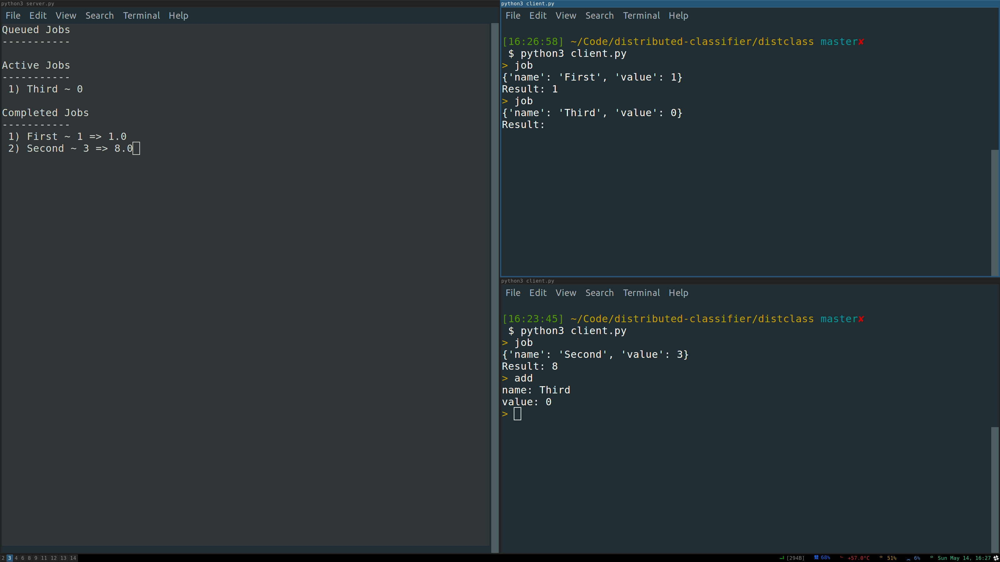

# Distributed Classifier
This is a simple distributed classification system that I created in order to learn more about implementing concurrent systems.



The system keeps a queue of jobs that need to be processed, jobs can be requested through a web api and job results can also be posted. This allows any client to be able to request and process jobs.

Currently the jobs are very simplistic, having only a name and value assocated with them and a single result value expected. However, I will try to expand this to be able to simulate a distributed real-time star classification system.

## Usage
### Server
The server for the Distributed Classifier can be started by running the `server.py` file. By default it uses port `5000` and loads in two default test jobs.

```
$ python3 server.py
```

### Cli Client
A simple cli client for the server is included. It can be started by running the `client.py` file.

```
$ python3 client.py
```

The client supports the following commands:

* `job` - Requests a job from the server and then prompts for a result to send back to the server for that job.
* `add` - Prompts the user for a newjob to create and then sends that job to the server.
* `quit` - Exits the cli client.

## License
The source code for Distributed Classifier is available under the [MIT License](https://opensource.org/licenses/MIT), see `LICENSE` for more information.
